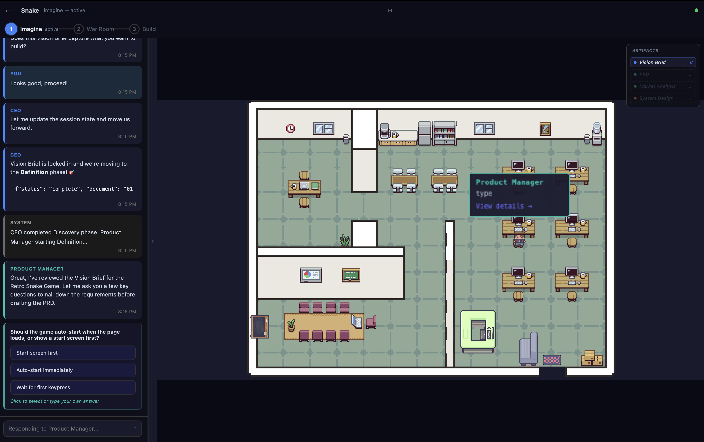

# The Office 🖥️

**A virtual pixel-art startup that builds your software for you.**

An open-source Electron app where a team of AI agents — CEO, Product Manager, Architect, Engineers, DevOps, UI/UX, and more — collaborate to take your idea from a one-line pitch all the way to a working, committed codebase. You watch the whole thing happen on a pixel-art map: agents walk to their desks, type at their monitors, gather in the boardroom for design reviews, and ship code from the open-work area.

    



---

## ✨ What is this?

Most AI coding tools give you a chat box and a single agent. **The Office gives you a whole startup.**

Hand it an idea — *"a habit tracker with streak rewards"*, *"a World Cup prediction game with friend leagues"*, *"a markdown-driven docs site"* — and it routes the work through a structured four-phase pipeline. Each phase is run by a specialized agent (or several) backed by the [Claude Agent SDK](https://docs.anthropic.com/claude-agent-sdk). They write actual artifacts to your project — vision briefs, PRDs, market analysis, HTML mockups, system designs, kanban tasks — and ultimately produce real source files committed to a real git repo.

You stay in the driver's seat the whole way: you approve mockups, lock the implementation plan, restart phases if you don't like the direction, and watch the canvas to see who's working on what.

It's a **project generator**, a **living planning canvas**, and an **agent observability tool** all in one — and it runs entirely on your machine.

## 🎬 The Office flow

Every project moves through four phases. Each phase has its own dedicated room on the map and its own cast of characters.

### 1. 💡 Imagine — *the boardroom*

You pitch your idea in chat. The agents take over and build the design package together:

| Agent | Output |
|---|---|
| **CEO** | `01-vision-brief.md` — the elevator pitch + non-goals |
| **Product Manager** | `02-prd.md` — full product requirements doc |
| **Market Researcher** | `03-market-analysis.md` — competitors, positioning, demand signals |
| **UI/UX Expert** | `05-ui-designs/` — 5–8 self-contained HTML mockups + index |
| **Chief Architect** | `04-system-design.md` — stack picks, data model, infra outline |

You review the UI mockups in a built-in dialog (open each in your browser, send back revisions, or approve). Each acted artifact is idempotent: if you close the app mid-imagine and come back, the orchestrator skips what's already on disk and continues.

### 2. 🪖 War Room — *the conference table*

The **Project Manager** turns the design docs into a milestone-driven `plan.md`, and the **Team Lead** breaks it down into `tasks.yaml` — a dependency-graph of small Claude-task units, each with explicit acceptance criteria. You review and approve the plan before anything ships.

### 3. 🔨 Build — *the open-work area*

The **Team Lead** dispatches tasks to engineers (Frontend, Backend, Mobile, Data, DevOps, Automation). Each engineer claims a PC seat (`pc-1` … `pc-6`), the monitor lights up, and they start typing. A two-stage review (spec + quality) runs on each completed task. Concurrent tasks for different engineering roles run in parallel via a worker pool.

Greenfield projects get an automatic git repo with one commit per phase (`Initial commit (The Office)`, `imagine: …`, `warroom: …`, `build: …`). Every restart creates an `office/iteration-N` backup branch first, so you never lose committed work.

### 4. 🎉 Complete — *celebration time*

The DevOps agent emits a `RUN.md` so anyone can boot the project, and the canvas hosts a small confetti choreography. From here you can re-enter **Workshop mode** to send incremental change requests against the existing repo — each request runs as an isolated git branch and gets merged on accept.

---

## 🚀 Quick start

### Prerequisites
- **Node.js 20+** and **npm**
- A Claude API key or active [Claude Code](https://docs.anthropic.com/en/docs/claude-code) subscription (the app will guide you through connecting one on first launch)

### Install + run
```bash
git clone https://github.com/shahar061/the-office.git
cd the-office
npm install
npm run dev
```

That boots the Electron app in dev mode with HMR.

### First project
1. Click **Create Project**, give it a name, pick a folder.
2. The CEO greets you in chat — type your idea (a sentence or two is plenty).
3. Watch the imagine phase play out; review and approve the mockups when prompted.
4. Click **Continue to War Room** when imagine completes.
5. Approve the plan. Click **Start Build**.
6. The kanban panel and the canvas update live as engineers run tasks.
7. When build finishes, your project is in the folder you picked, with a clean git history.

### Other commands
```bash
npm run build           # Production bundle (electron-vite)
npm run test            # Vitest single run
npm run test:watch      # Watch mode
npm run dev:jump        # Dev tool — jump straight to a specific agent/phase
```

---

## 🤝 Contributing — we want your help

**The Office is a community project.** It's ambitious in scope (a pixel-art Electron app + a multi-agent orchestrator + a designed-from-scratch UX), and there's far more to build than any one maintainer can ship alone. If any of this resonates with you, you're in the right place.

### How to contribute

1. **Open an issue first** for anything non-trivial — even a "I'd like to try X, sound good?" comment on an existing issue is enough to start a discussion.
2. **Fork → branch → PR.** Branch names that mirror the area help (`feat/kanban-graph-zoom`, `fix/mr-desk-pathfinding`, `i18n/he-onboarding`).
3. **Keep PRs focused.** A small, well-tested change lands in days; a sprawling one stalls.
4. **Tests for non-trivial logic.** Vitest is set up; please add coverage where it makes sense (especially anything touching the orchestrator, git flows, or the seat/clone manager).
5. **Match the existing tone.** Code is plain TypeScript with no class-heavy abstractions; comments explain *why*, not *what*.

### Where we need help

These are concrete areas where contributions would have the biggest impact today. Pick anything that catches your eye.

#### 🌍 Internationalization
- More language packs beyond English + Hebrew. The dictionary lives in `src/renderer/src/i18n/dictionaries/`. Adding a new locale is mostly translation work plus a one-line registration.
- RTL polish — there's already a Hebrew pass, but there are always edge cases (drag handles, popups, scrollbars).

#### 🎨 Pixel-art assets
- More agent sprite variants (we currently reuse three sprite sheets across 15 roles).
- New office rooms / decorations on the Tiled map (`src/renderer/src/assets/maps/office.tmj`).
- Phase-specific environmental touches (war room whiteboards updating, build-phase server racks lighting up, etc.).

#### 🤖 Orchestrator depth
- More phase agents (security review, accessibility audit, performance review).
- Better dependency tracking in the build phase — the current task graph is simple; we'd love a richer one.
- Smarter retry/recovery when an agent fails to produce an expected artifact.

#### 🧰 Tooling integrations
- Other coding-agent SDKs alongside Claude (Codex, OpenCode SQLite, locally-hosted models via Ollama, etc.). The adapter shape is small and friendly.
- Optional CI integration so the build phase can run real test suites and report back into the kanban.

#### 📱 Mobile companion
- The repo ships an experimental mobile viewer (`mobile/`) that mirrors the office in real time. It works but the UX is rough — pairing flow, push notifications, offline mode, and design polish would all be welcome.

#### 📖 Documentation
- Onboarding screencasts.
- Per-phase "what to expect" walkthroughs.
- A clean architecture deep-dive (the orchestrator → SDK bridge → renderer flow is non-obvious).

### Good first issues

Look for the [`good first issue`](https://github.com/shahar061/the-office/labels/good%20first%20issue) label on the issue tracker. Examples of what tends to land there: missing translations, sprite tweaks, polish on a specific dialog, small bugs we've already triaged.

If nothing's tagged yet and you want to dive in, open a discussion describing what you'd like to tackle and we'll scope it together.

### Reporting bugs

Use the **Report a bug** button inside the app (top-right icon rail → 🐛). It auto-attaches your platform, app version, and language, and posts straight into the project's bug tracker. For things that are blocking you right now, also drop an issue on GitHub so we can discuss in the open.

### Code of conduct

Be kind, be specific, assume good faith. We're building this for fun and for craft — let's keep it that way.

---

## 🏗 Architecture

```
┌─────────────────────────────────────────────────────────────┐
│  Renderer (React + PixiJS)                                  │
│  ┌────────┐ ┌─────────┐ ┌────────┐ ┌────────┐ ┌──────────┐  │
│  │  Chat  │ │ Pixel   │ │ Kanban │ │ Stats  │ │   Logs   │  │
│  │  Panel │ │ Office  │ │ Board  │ │ Panel  │ │   View   │  │
│  └────────┘ └─────────┘ └────────┘ └────────┘ └──────────┘  │
│              Zustand stores · i18n · split layout            │
├──────────────── IPC bridge (preload.ts) ─────────────────────┤
│  Main process (Electron)                                    │
│  ┌──────────────────────────────────────────────────────┐   │
│  │  Phase orchestrators (imagine / warroom / build /    │   │
│  │  workshop) → SDK bridge → Claude Agent SDK           │   │
│  │  Project manager · Artifact store · Chat history     │   │
│  │  Greenfield git · Workshop git gate                  │   │
│  └──────────────────────────────────────────────────────┘   │
├──────────────────────────────────────────────────────────────┤
│  Project on disk                                            │
│   docs/office/   .the-office/   src/   …                    │
│   01-vision-brief.md   chat-history/                        │
│   02-prd.md            pending-question.json                │
│   …                                                          │
│   git: Initial commit · imagine: … · warroom: … · build: …  │
└──────────────────────────────────────────────────────────────┘
```

### Project layout

```
the-office/
├── electron/               # Main process
│   ├── main.ts            # App bootstrap
│   ├── preload.ts         # window.office IPC bridge
│   ├── ipc/               # IPC handlers (project, phase, settings, mobile)
│   ├── orchestrator/      # imagine, warroom, build, workshop runners
│   ├── sdk/               # Claude Agent SDK bridge + permission handler
│   └── project/           # Git, artifact store, chat history, scanner
├── src/renderer/src/       # Renderer (React + PixiJS)
│   ├── components/        # Chat, Kanban, Settings, Workshop, Split layout, …
│   ├── office/            # PixiJS scene, characters, engine, fog of war
│   ├── stores/            # Zustand: project, chat, office, kanban, layout, …
│   └── i18n/              # Translation dictionaries (en, he)
├── mobile/                 # Experimental mobile companion
├── shared/                 # Types + reducers shared between processes
├── agents/                 # Agent role definitions (.md system prompts)
├── feedback-admin/         # Cloudflare Pages bug-report dashboard
├── feedback-worker/        # Cloudflare Worker bug-report intake
├── dev-jump/               # Dev-only tool to seed a project mid-flow
└── tests/                  # Vitest suite
```

### Key concepts

- **Agents are markdown.** Each role's system prompt lives in `agents/<role>.md`. Edit the file, restart, and the agent's personality and tools change.
- **Phases are idempotent.** Each phase's runner uses `runAct` to skip work whose artifact already exists on disk, so reopening a half-done project picks up where you left off.
- **Greenfield git is automatic.** New projects get a git repo with one commit per phase. Restarting a phase parks the previous work on `office/iteration-N` and resets `main`.
- **Engineers ride clones.** The 6 engineering roles share a pool of 6 PC seats (`pc-1`…`pc-6`); a clone character is spawned per active session and despawned when refcount reaches zero (debounced to absorb worker-pool churn).

## 🧰 Tech stack

| Layer | Technology |
|---|---|
| Desktop framework | Electron 41 |
| UI framework | React 19 |
| 2D rendering | PixiJS 8 (WebGL/WebGPU) |
| State management | Zustand 5 |
| Build tooling | Vite 6 + electron-vite 5 |
| Agent SDK | `@anthropic-ai/claude-agent-sdk` |
| File watching | Chokidar 5 |
| Testing | Vitest 1.6 |
| Map format | Tiled JSON (.tmj) |
| Sprite assets | LimeZu pixel-art character sheets |

## 📜 License

ISC. Use it, fork it, ship things with it. Attribution is appreciated but not required.

---

*Built with care, in the open. PRs and issues warmly welcomed.*
